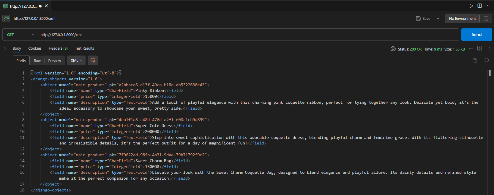

# Marquette

Marquette merupakan proyek Django untuk tugas mata kuliah Pemrograman Berbasis Platform Ganjil 2024/2025 oleh Steven Setiawan dengan NPM 2306152260.

PWS Link : http://steven-setiawan-marquette.pbp.cs.ui.ac.id/

## Daftar Isi
- [README.md Tugas 2](#tugas-2)
  - [Implementasi Checklist Tugas 2](#implementasi-checklist-tugas-2)
  - [Bagan request client ke web aplikasi berbasis Django](#buatlah-bagan-yang-berisi-request-client-ke-web-aplikasi-berbasis-django-beserta-responnya-dan-jelaskan-pada-bagan-tersebut-kaitan-antara-urlspy-viewspy-modelspy-dan-berkas-html)
  - [Fungsi Git dalam pengembangan perangkat lunak](#jelaskan-fungsi-git-dalam-pengembangan-perangkat-lunak)
  - [Alasan framework Django dijadikan permulaan pembelajaran](#menurut-anda-dari-semua-framework-yang-ada-mengapa-framework-django-dijadikan-permulaan-pembelajaran-pengembangan-perangkat-lunak)
  - [Mengapa model Django disebut sebagai ORM?](#mengapa-model-pada-django-disebut-sebagai-orm)

- [README.md Tugas 3](#tugas-3)
  - [Implementasi Checklist Tugas 3](#implementasi-checklist-tugas-3)
  - [Mengapa kita membutuhkan _data delivery_ dalam sebuah platform?](#jelaskan-mengapa-kita-memerlukan-data-delivery-dalam-pengimplementasian-sebuah-platform)
  - [Manakah yang lebih baik? XML atau JSON?](#menurutmu-mana-yang-lebih-baik-antara-xml-dan-json-mengapa-json-lebih-populer-dibandingkan-xml)
  - [Fungsi is_valid() pada form Django](#jelaskan-fungsi-dari-method-is_valid-pada-form-django-dan-mengapa-kita-membutuhkan-method-tersebut)
  - [Mengapa kita membutuhkan csrf_token dalam membuat form?](#mengapa-kita-membutuhkan-csrf_token-saat-membuat-form-di-django-apa-yang-dapat-terjadi-jika-kita-tidak-menambahkan-csrf_token-pada-form-django-bagaimana-hal-tersebut-dapat-dimanfaatkan-oleh-penyerang)
  - [Dokumentasi hasil akses URL pada Postman](#dokumentasi-akses-url-pada-postman)

- [README.md Tugas 4](#tugas-4)
  - [Implementasi Checklist Tugas 4](#implementasi-checklist-tugas-4)
  - [Apa perbedaan antara `HttpResponseRedirect()` dan `redirect()`](#apa-perbedaan-antara-httpresponseredirect-dan-redirect)
  - [Jelaskan cara kerja penghubungan model `Product` dengan `User`](#jelaskan-cara-kerja-penghubungan-model-product-dengan-user)
  - [Apa perbedaan antara _authentication_ dan _authorization_](#apa-perbedaan-antara-authentication-dan-authorization-apakah-yang-dilakukan-saat-pengguna-login-jelaskan-bagaimana-django-mengimplementasikan-kedua-konsep-tersebut)
  - [Bagaimana Django mengingat pengguna yang telah login?](#bagaimana-django-mengingat-pengguna-yang-telah-login-jelaskan-kegunaan-lain-dari-cookies-dan-apakah-semua-cookies-aman-digunakan)

- [README.md Tugas 5](#tugas-5)
  - [Implementasi Checklist Tugas 5]
  - [Jelaskan urutan prioritas pengambilan CSS selector]
  - [Mengapa _responsive design_ menjadi konsep yang penting dalam pengembangan aplikasi web]
  - [Jelaskan perbedaan antara _margin, border,_ dan _padding_]
  - [Jelaskan konsep _flex box_ dan _grid layout_ beserta kegunaannya]

## Tugas 2

## Implementasi Checklist Tugas 2.

<details>
<summary>Membuat sebuah proyek Django baru</summary>

Untuk membuat proyek Django baru, langkah pertama yang saya lakukan adalah membuat folder dengan nama proyek yang saya inginkan.

Untuk melakukan itu, saya menjalankan command berikut:

```
mkdir marquette
cd marquette
```

Setelah itu, saya membuat dan mengaktifkan virtual environment pada folder tersebut dengan menggunakan command berikut:

```
python -m venv env
env\Scripts\activate
```

Kemudian, saya membuat file `requirements.txt` dan mengisinya dengan dependency proyek yang saya butuhkan. Lalu, saya menjalankan command berikut untuk menginstall seluruh module tersebut di virtual environment saya.

```
pip install -r requirements.txt
```

Setelah melakukan penginstallan dependency, saya membuat sebuah proyek Django baru dengan nama `marquette` menggunakan command berikut:

```
django-admin startproject marquette .
```

Di dalam folder marquette, saya menambahkan `ALLOWED_HOSTS` dalam `settings.py` agar dapat dilakukan deployment secara local.

```py
ALLOWED_HOSTS = ["localhost", "127.0.0.1"]
```

Setelah menambahkan `ALLOWED_HOSTS` tersebut, saya melakukan deployment secara local dengan menggunakan command:

```
python manage.py migrate
python manage.py runserver
```

Deployment berhasil dan dapat diakses melalui http://127.0.0.1:8000/

</details>

<details>
<summary>Membuat aplikasi main pada proyek</summary>

Setelah deployment berhasil dilakukan di local, saya membuat aplikasi `main` pada proyek dengan menjalankan:

```
python manage.py startapp main
```

Terlihat ada folder baru pada root folder dengan nama `main`. Hal ini menandakan bahwa aplikasi main berhasil ditambahkan pada proyek.
</details>

<details>
<summary>Melakukan routing pada proyek agar dapat menjalankan aplikasi main</summary>
Selanjutnya, agar aplikasi main dapat dijalankan, kita perlu terlebih dahulu melakukan routing pada proyek. Hal ini dilakukan dengan membuka file `settings.py` pada direktori proyek `marquette` dan menambahkan `main` pada variabel `INSTALLED_APPS`.

```py
INSTALLED_APPS = [
    ...,
    'main'
]
```
</details>

<details>
<summary>Membuat model pada aplikasi main</summary>

Setelah melakukan routing agar dapat menjalankan aplikasi `main`, selanjutnya kita akan membuat model. Hal ini dilakukan dengan memodifikasi file `models.py` pada folder `main`. Berikut adalah kode yang saya tambahkan:

```py
class Product(models.Model) :
    name = models.CharField(max_length=255)
    price = models.IntegerField()
    description = models.TextField()
```

Sebelum melanjutkan proyek ini, terlebih dahulu saya melakukan migration pada models yang saya buat dengan menjalankan:

```
python manage.py makemigrations
python manage.py migrate
```

Migration dilakukan untuk merefleksikan perubahan dalam model ke database schema (memastikan model dicatat dalam database schema).
</details>

<details>
<summary>Membuat sebuah fungsi pada views.py</summary>

Kemudian, saya membuat folder baru pada main dengan nama templates dan membuat file baru bernama main.html. main.html berfungsi sebagai display tampilan dari aplikasi main saya. Berikut adalah kode pada main.html saya:

```html
<!DOCTYPE html>
<html lang="en">
<head>
    <meta charset="UTF-8">
    <meta name="viewport" content="width=device-width, initial-scale=1.0">
    <title>{{ app_name }}</title>

    <h1>Welcome to {{ app_name }}</h1>
    <h2>We're selling all Coquette items y'all ever need!</h2>
    <h4>Made by {{ name }} from {{ class }} class</h4>
</head>
<body>
    
</body>
</html>
```

Untuk mengisi nilai/value pada template variables app_name, name, dan class, saya kemudian membuat fungsi pada views.py di folder `main`. Berikut adalah kode yang saya tambahkan:

```py
def show_main(request) :
    context = {
        'app_name' : 'Marquette',
        'name' : 'Steven Setiawan',
        'class' : 'PBP D'
    }
    return render(request, "main.html", context)
```
</details>

<details>
<summary>Membuat routing pada urls.py aplikasi main</summary>

Selanjutnya, saya melakukan konfigurasi routing urls.py agar aplikasi `main` dapat diakses melalui peramban ketika proyek dijalankan. Saya membuat file baru bernama `urls.py` pada direktori `main` dan menambahkan kode berikut:

```py
from django.urls import path
from main.views import show_main

app_name = 'main'

urlpatterns = [
    path('', show_main, name='show_main'),
]
```

Setelahnya, saya menambahkan routingan URL dari aplikasi main ke `urls.py` pada direktori proyek. Berikut adalah file `urls.py` setelah dilakukan modifikasi:

```py
from django.contrib import admin
from django.urls import path, include

urlpatterns = [
    path('admin/', admin.site.urls),
    path('', include('main.urls')),
]
```
</details>

<details>
<summary>Melakukan deployment ke PWS</summary>

Setelah proyek berhasil dibuat, saya akan menyimpannya pada repository github serta mendeploynya pada PWS.

- **GitHub**

  Untuk menyimpan program yang telah saya buat dalam GitHub, terlebih dahulu saya membuat file `.gitignore` yang berisikan nama-nama file/folder yang tidak ingin saya simpan di dalam repository GitHub.

  Kemudian, saya membuat repository baru bernama `marquette` melalui web https://github.com/ dan kemudian menjalankan command berikut:

  ```
  git init
  git branch -M main
  git remote add origin https://github.com/setiawans/marquette.git
  git add .
  git commit -m "initial commit"
  git push -u origin main
  ```

- **PWS**
  
  Setelah menyimpan program di GitHub, selanjutnya saya akan melakukan deployment menggunakan PWS. Terlebih dahulu saya menambahkan `ALLOWED_HOSTS` pada `settings.py` di direktori proyek.

  ```py
  ALLOWED_HOSTS = ["localhost", "127.0.0.1", "steven-setiawan-marquette.pbp.cs.ui.ac.id"]
  ```

  Selanjutnya, saya menjalankan command berikut:
  ```
  git remote add pws http://pbp.cs.ui.ac.id/steven.setiawan/marquette
  git branch -M master
  git push pws master
  ```

  Apabila ke depannya saya perlu melakukan update pada deployment tersebut, saya dapat menjalankan command berikut:
  
  ```
  git branch -M main
  git push pws main:master
  ```
</details>

## Buatlah bagan yang berisi request client ke web aplikasi berbasis Django beserta responnya dan jelaskan pada bagan tersebut kaitan antara urls.py, views.py, models.py, dan berkas html.


Ketika user/client mengakses aplikasi, request akan dikirimkan ke webserver. Request ini akan diolah di `urls.py` dan kemudian diteruskan ke `views.py` yang sesuai/bersangkutan.

Setelah itu, `views.py` akan berinteraksi/berkomunikasi dengan `models.py` yang juga berkomunikasi dengan `database` untuk melakukan proses read/write data jika diperlukan.

Setelah data diproses dan diterima, data akan didisplay oleh `views.py` dengan menggunakan templates yang berisikan berkas html. Halaman html inilah yang akan ditampilkan dan diakses oleh user/client.

## Jelaskan fungsi git dalam pengembangan perangkat lunak!
Git merupakan sebuah _version control system_ yang memungkinkan kita selaku pengembang untuk melacak perubahan-perubahan kode dari waktu ke waktu. Git mempermudah kita melakukan kolaborasi dengan pengembang lainnya secara online dengan memanfaatkan fitur branch yang berbeda. Dengan demikian, setiap anggota tim dapat bekerja tanpa mengganggu kode satu sama lain. Selanjutnya, Git memudahkan pengembang dalam menyimpan proyek-proyek yang telah mereka buat tanpa perlu khawatir adanya kerusakan atau kehilangan pada kode mereka. Selain fungsi-fungsi yang telah disebutkan di atas, Git masih memiliki banyak sekali fungsi lainnya. Secara umum, Git meningkatkan efisiensi setiap pengembang dalam melakukan pengembangan perangkat lunak.

## Menurut Anda, dari semua framework yang ada, mengapa framework Django dijadikan permulaan pembelajaran pengembangan perangkat lunak?
Menurut saya, Django cocok menjadi titik awal pembelajaran pengembangan perangkat lunak karena framework ini berbasiskan bahasa pemrograman Python, yang terkenal ramah untuk dipelajari oleh pemula. Selanjutnya, Django menawarkan arsitektur yang terstruktur sekaligus mudah sekali untuk digunakan oleh para pemula, yakni arsitektur MVT atau Model-View-Template. Selain itu, Django juga memungkinkan pengembangan secara fullstack, yang mendukung hubungan antara front-end dan back-end secara sekaligus dalam satu framework.

## Mengapa model pada Django disebut sebagai ORM?
Model pada Django disebut sebagai ORM (Object-Relational Mapping) dikarenakan Django memetakan objek-objeknya dengan database relasional. ORM menjadi interpreter yang memungkinkan kita berinteraksi dengan database tanpa perlu menuliskan query-query SQL secara manual.

## Tugas 3

## Implementasi Checklist Tugas 3.

<details>
<summary>Membuat input form untuk menambahkan objek model pada app sebelumnya</summary>

Sebelum membuat input `form`, karena page utama dan form kita memiliki beberapa bagian kode yang sama, maka kita dapat membuat suatu templates umum untuk mengurangi pengulangan kode yang repetitif.
Dalam mengimplementasikan hal tersebut, terlebih dahulu saya membuat direktori baru bernama `templates/` pada direktori utama dan mengisinya dengan berkas `base.html`. Berikut adalah isi dari `base.html`:

```html

<!DOCTYPE html>
<html lang="en">
  <head>
    <meta charset="UTF-8" />
    <meta name="viewport" content="width=device-width, initial-scale=1.0" />
     
  </head>

  <body>
     
  </body>
</html>
```

Setelah itu, agar `base.html` bisa digunakan sebagai template pada proyek kita, kita perlu mengubah `settings.py` terlebih dahulu. Berikut adalah bagian yang saya modifikasi dari `settings.py`:

```py
TEMPLATES = [
    {
        'BACKEND': 'django.template.backends.django.DjangoTemplates',
        'DIRS': [BASE_DIR / 'templates'],
        'APP_DIRS': True,
        ...
    },
]
```

Setelah mengubah `settings.py`, saya langsung mengaplikasikan `base.html` pada berkas `main.html` yang terletak di direktori `main/templates/`. Berikut adalah hasil modifikasi dari `main.html`:

```html


<title>{{ app_name }}</title>



<h1>Welcome to {{ app_name }}</h1>
<h2>We're selling all Coquette items y'all ever need!</h2>
<h4>Made by {{ name }} from {{ class }} class</h4>

```

Selanjutnya, sebelum membuat form, terlebih dahulu kita mengubah primary key dari models yang sebelumnya berbentuk integer menjadi UUID. Hal ini dilakukan untuk mencegah terjadinya serangan IDOR pada proyek yang kita buat. Berikut adalah hasil modifikasi yang saya lakukan pada `models.py`:

```py
from django.db import models
import uuid

class Product(models.Model) :
    id = models.UUIDField(primary_key=True, default=uuid.uuid4, editable=False)
    name = models.CharField(max_length=255)
    price = models.IntegerField()
    description = models.TextField()
```

Setelah itu, kita lakukan migrasi terlebih dahulu dengan menggunakan perintah berikut:

```
python manage.py makemigrations
python manage.py migrate
```

Kita telah berhasil mengamankan proyek kita dari serangan IDOR. Serangan ini sendiri berfokus pada eksploitasi primary key dari setiap objek model yang telah kita buat, dengan demikian, penyerang dapat mengakses objek model yang bukan miliknya.

Kemudian, untuk membuat form, kita tambahkan berkas `forms.py` pada direktori `main`. Kemudian, saya mengisi `forms.py` dengan kode berikut:

```py
from django.forms import ModelForm
from main.models import Product

class ProductForm(ModelForm) :
    class Meta :
        model = Product
        fields = ["name", "price", "description"]
```

Setelah itu, saya melakukan sedikit modifikasi pada `views.py` yaitu melakukan import model dan form serta mengimport redirect dari library `django.shortcuts`.

```py
from django.shortcuts import render, redirect
from main.forms import ProductForm
from main.models import Product
```

Selanjutnya, masih di `views.py`, saya menambahkan fungsi baru bernama `create_product`. Berikut adalah potongan kode dari fungsi tersebut:

```py
def create_product(request) :
    form = ProductForm(request.POST or None)

    if form.is_valid() and request.method == "POST" :
        form.save()
        return redirect('main:show_main')
    
    context = {'form' : form}
    return render(request, "create_product.html", context)
```

Secara general, fungsi tersebut akan menampilkan page `create_product.html` kepada user. Apabila form disubmit (request method POST) dan isinya valid (`form.is_valid()`), maka data yang diinput akan disimpan pada database dan fungsi akan melakukan redirect ke page utama.

Kemudian, saya juga menambahkan sedikit potongan kode pada fungsi `show_main`. Berikut adalah hasil modifikasi pada fungsi `show_main`:

```py
def show_main(request) :
    products = Product.objects.all()

    context = {
        'app_name' : 'Marquette',
        'name' : 'Steven Setiawan',
        'class' : 'PBP D',
        'products' : products # Modifikasi dilakukan disini
    }
    
    return render(request, "main.html", context)
```

Penambahan kode tersebut dilakukan untuk nantinya menampilkan seluruh list product pada `main.html`.

Selanjutnya, kita akan menambahkan views `create_product` ke `urls.py`. Berikut adalah hasil modifikasi yang telah saya lakukan:

```py
from django.urls import path
from main.views import show_main, create_product

app_name = 'main'

urlpatterns = [
    path('', show_main, name='show_main'),
    path('create-product', create_product, name='create_product'),
]
```

Setelah itu, agar fungsi `create_product` bisa menampilkan form yang telah kita buat, kita tambahkan berkas `create_product.html` pada direktori `main/templates/`. Berikut adalah isi dari `create_product.html`:

```html
 

<h1>Add New Product</h1>

<form method="POST">
  
  <table>
    {{ form.as_table }}
    <tr>
      <td></td>
      <td>
        <input type="submit" value="Add Product" />
      </td>
    </tr>
  </table>
</form>


```

Kemudian, kita modifikasi juga `main.html` untuk menampilkan seluruh data product yang telah kita buat serta tombol "Add New Product" yang akan melakukan _redirect_ ke halaman form. Berikut adalah potongan kode yang saya tambahkan: 

```html
...

<p>Belum ada data product pada Marquette.</p>

<table>
    <tr>
        <th>Product Name</th>
        <th>Price</th>
        <th>Description</th>
    </tr>

     Berikut cara memperlihatkan data product di bawah baris ini
    
    
    <tr>
        <td>{{product.name}}</td>
        <td>{{product.price}}</td>
        <td>{{product.description}}</td>
    </tr>
    
</table>


<br />
<a href="">
    <button>Add New Product</button>
</a>

```

Form telah berhasil diimplementasikan pada proyek kita! Untuk mengecek apakah proyek dapat berjalan dengan baik, jalankan perintah berikut:

```
python manage.py runserver
```
</details>

<details>
<summary>Menambahkan 4 fungsi views baru untuk melihat objek yang sudah ditambahkan dalam format XML, JSON, XML by ID, dan JSON by id</summary>

Kemudian, karena sebelumnya kita telah mengimplementasikan pembuatan objek product yang baru menggunakan form, tentu kita perlu mengetahui cara mengakses masing-masing product tersebut. Untuk itu, kita perlu membuat views yang menampilkan data dalam format XML maupun JSON.

Pertama-tama, kita import library `HttpResponse` dan `serializers` dengan menambahkan potongan kode berikut pada `views.py` di direktori `main`:

```py
from django.http import HttpResponse
from django.core import serializers
```

Kemudian, untuk menampilkan data, baik secara keseluruhan ataupun berdasarkan hasil filtering UUID, dalam format XML, saya menambahkan views berikut dalam `views.py`:

```py
def show_xml(request) :
    data = Product.objects.all()
    return HttpResponse(serializers.serialize("xml", data), content_type="application/xml")

def show_xml_by_id(request, id) :
    data = Product.objects.filter(pk = id)
    return HttpResponse(serializers.serialize("xml", data), content_type="application/xml")
```

Pada potongan kode tersebut, fungsi `show_xml` akan mengembalikan seluruh objek yang ada pada database dalam format XML. Hal ini dilakukan dengan mengambil seluruh objek dari model Product, kemudian mengubahnya menjadi format XML dengan memanfaatkan serializers. Fungsi kedua juga mirip, tetapi terdapat filtering pada objek yang diambil, yaitu berdasarkan id.

Hal yang sama juga diimplementasikan untuk menampilkan data dalam bentuk JSON. Berikut adalah potongan kodenya:

```py
def show_json(request) :
    data = Product.objects.all()
    return HttpResponse(serializers.serialize("json", data), content_type="application/json")

def show_json_by_id(request, id) :
    data = Product.objects.filter(pk = id)
    return HttpResponse(serializers.serialize("json", data), content_type="application/json")
```
</details>

<details>
<summary>Membuat routing URL untuk masing-masing views</summary>

Untuk membuat routing URL dari masing-masing `views` tersebut, terlebih dahulu saya melakukan import views ke berkas `urls.py` di direktori `main/`.

```py
from main.views import show_main, create_product, show_xml, show_json, show_xml_by_id, show_json_by_id
```

Setelah melakukan import views, saya kemudian menambahkan path untuk masing-masing view tersebut.

```py
urlpatterns = [
    ...
    path('xml/', show_xml, name='show_xml'),
    path('json/', show_json, name='show_json'),
    path('xml/<str:id>/', show_xml_by_id, name='show_xml_by_id'),
    path('json/<str:id>/', show_json_by_id, name='show_json_by_id'),
]
```

Path pertama dan kedua berfungsi untuk menampilkan seluruh data dalam format XML dan JSON. Sedangkan, path ketiga dan keempat akan menampilkan data sesuai dengan filtering UUID, hal ini terlihat pada bagian kode `<str:id>`. Dengan demikian, misalkan kita ingin melihat product dengan UUID tertentu dalam format JSON, kita hanya perlu membuka URL `http://127.0.0.1:8000/json/<UUID>`.
</details>

## Jelaskan mengapa kita memerlukan data delivery dalam pengimplementasian sebuah platform?
Dalam mengimplementasikan sebuah _platform_, _data delivery_ sangat diperlukan untuk proses pertukaran data antara satu bagian/_stack_ dengan bagian lainnya. Dengan adanya mekanisme _data delivery_ ini, proses pengelolaan data, terutama antara front-end dan back-end, akan berjalan jauh lebih baik dan efisien. Hal ini didukung dengan fleksibilitas format data seperti XML dan JSON. Apabila suatu _platform_ tidak mengimplementasikan mekanisme ini, _platform_ tersebut tidak akan berfungsi secara maksimal karena data-data yang masuk tidak dapat dikelola dengan baik oleh berbagai komponen/bagian _platform_ tersebut.

## Menurutmu, mana yang lebih baik antara XML dan JSON? Mengapa JSON lebih populer dibandingkan XML?
Menurut diri saya pribadi, JSON masih lebih baik dibandingkan XML karena tingkat _readability_ kode yang lebih tinggi. Hal ini jugalah yang menyebabkan JSON lebih populer dibandingkan XML. Perbandingan _readability_ ini didasarkan pada fakta bahwa struktur JSON mirip dengan struktur _dictionary_ python yang mengimplementasikan key:value pair, sehingga JSON lebih umum dan mudah untuk dipahami oleh para pengembang. Hal ini juga didukung dengan keringkasan serta simplesitas JSON dibandingkan XML, yang terkesan lebih bertele-tele. Selain itu, JSON juga sudah terintegrasi dengan bahasa JavaScript, sehingga memudahkan implementasinya dalam pengembangan _platform_. Walaupun begitu, XML masih berguna untuk beberapa kasus proyek yang memerlukan implementasi kompleks (yang tidak dapat dilakukan oleh JSON), sehingga XML tidak semena-mena menjadi bahasa yang _useless_ atau tidak berguna karena tidak sebaik JSON dalam proyek skala kecil.

## Jelaskan fungsi dari method is_valid() pada form Django dan mengapa kita membutuhkan method tersebut?
Method `is_valid()` berfungsi untuk memvalidasi data yang diinput/dimasukkan oleh user pada form yang telah kita buat. Method ini akan mengecek apakah input yang dimasukkan oleh user sesuai dengan aturan yang telah kita buat sebelumnya. Apabila input dari user dianggap valid, maka method akan mengembalikan respon `True` dan data pada form akan diproses dan disimpan pada database.

Method `is_valid()` diperlukan untuk memastikan kevalidan data dari input yang dimasukkan oleh user. Dengan demikian, kita dapat memastikan integritas serta keamanan _platform_ yang telah kita buat. Selain itu, adanya validasi ini akan memastikan konsistensi serta kebersihan database dan memudahkan proses _maintenance_ yang dilakukan oleh para pengembang ke depannya.

## Mengapa kita membutuhkan csrf_token saat membuat form di Django? Apa yang dapat terjadi jika kita tidak menambahkan csrf_token pada form Django? Bagaimana hal tersebut dapat dimanfaatkan oleh penyerang?
`csrf_token` dibutuhkan dalam pembuatan form di Django untuk mencegah terjadinya _exploit_ CSRF (Cross-Site Request Forgery). CSRF atau sering dikenal sebagai _one-click attacks_ adalah sebuah kerentanan pada keamanan website di mana penyerang akan mengirimkan permintaan berbahaya sebagai user yang sudah terauntetikasi.

Apabila suatu form tidak mengimplementasikan `csrf_token`, maka penyerang dapat dengan mudah melancarkan serangan CSRF. Hal ini didasarkan pada fakta bahwa _platform_ akan menganggap setiap `request` yang dilakukan adalah valid dan benar dari user. Dengan demikian, penyerang dapat mengirimkan _well crafted malicious request_ untuk mengeksekusi tindakan berbahaya.

Dengan mengimplementasikan `csrf_token`, setiap _request_ yang dilakukan oleh user dapat dicek kevalidannya, dikarenakan token ini akan digenerate oleh `server-side application` dan tidak dapat diketahui oleh penyerang. Dengan demikian, apabila penyerang mengirimkan _request_ melalui form, _platform_ dapat langsung mengetahui bahwa _request_ tersebut bukanlah _request_ dari pengguna, melainkan dari penyerang.

## Dokumentasi akses URL pada Postman
- `GET /xml`
  
- `GET /json`
  
- `GET /xml/<UUID>`
  
- `GET /json/<UUID>`
  

## Tugas 4

## Implementasi Checklist Tugas 4
<details>
<summary>Mengimplementasikan fungsi registrasi, login, dan logout</summary>

- **Registrasi**

  Dalam mengimplementasikan fungsi registrasi, terlebih dahulu saya melakukan _import_ beberapa _library_ yang saya perlukan, seperti `UserCreationForm` dan `messages` pada berkas `views.py`. Berikut adalah kode yang saya tambahkan:

  ```py
  from django.contrib.auth.forms import UserCreationForm
  from django.contrib import messages
  ```

  Setelah menambahkan _library_ tersebut, saya juga menambahkan fungsi register pada `views.py` yang berfungsi untuk membuat form registrasi secara otomatis serta membuat akun pengguna ketika form di-_submit_. Berikut adalah potongan kode yang saya tambahkan:

  ```py
  def register(request):
    form = UserCreationForm()

    if request.method == "POST":
        form = UserCreationForm(request.POST)
        if form.is_valid():
            form.save()
            messages.success(request, 'Your account has been successfully created!')
            return redirect('main:login')
    context = {'form':form}
    return render(request, 'register.html', context)
  ```

  Setelah itu, untuk menampilkan form registrasi, kita tambahkan berkas `register.html` pada direktori `main/templates`. Berikut adalah isi dari `register.html`:
  
  ```html
  

  
  <title>Register</title>
  

  

  <div class="login">
    <h1>Register</h1>

    <form method="POST">
      
      <table>
        {{ form.as_table }}
        <tr>
          <td></td>
          <td><input type="submit" name="submit" value="Daftar" /></td>
        </tr>
      </table>
    </form>

    
    <ul>
      
      <li>{{ message }}</li>
      
    </ul>
    
  </div>

  
  ```

  Kemudian, agar fungsi registrasi ini bisa digunakan, kita _import_ fungsi tersebut pada `urls.py` dan menambah _path url_-nya ke dalam `urlpatterns`. Berikut adalah kode yang saya tambahkan pada `urls.py`:

  ```
  from main.views import show_main, create_product, show_xml, show_json, show_xml_by_id, show_json_by_id, register
  ...
  urlpatterns = [
    ...
    path('register/', register, name='register'),
  ]
  ...
  ```
  Mekanisme `register` berhasil dibuat!

- **Login**

  Dalam mengimplementasikan fungsi login, sama seperti saat membuat fungsi registrasi, terlebih dahulu kita _import library-library_ yang diperlukan pada `views.py`. Berikut adalah kode yang saya tambahkan:
  
  ```py
  from django.contrib.auth.forms import UserCreationForm, AuthenticationForm
  from django.contrib.auth import authenticate, login  
  ```

  Selanjutnya, tambahkan fungsi `login_user` pada `views.py`. Fungsi ini akan berfungsi untuk melakukan autentikasi pengguna pada website kita. Apabila login berhasil, maka pengguna akan di-_redirect_ ke halaman utama kita. Berikut adalah kode yang saya tambahkan:
  
  ```py
  def login_user(request):
    if request.method == 'POST':
        form = AuthenticationForm(data=request.POST)

        if form.is_valid():
              user = form.get_user()
              login(request, user)
              return redirect('main:show_main')

    else:
        form = AuthenticationForm(request)
    context = {'form': form}
    return render(request, 'login.html', context)  
  ```

  Setelahnya, untuk menampilkan fungsi login tersebut, kita buat berkas baru bernama `login.html` pada direktori `main/templates`. Berikut adalah isi dari `login.html`:

  ```html
  

  
  <title>Login</title>
  

  
  <div class="login">
    <h1>Login</h1>

    <form method="POST" action="">
      
      <table>
        {{ form.as_table }}
        <tr>
          <td></td>
          <td><input class="btn login_btn" type="submit" value="Login" /></td>
        </tr>
      </table>
    </form>

    
    <ul>
      
      <li>{{ message }}</li>
      
    </ul>
     Don't have an account yet?
    <a href="">Register Now</a>
  </div>

    
  ```

  Selanjutnya, kita _import_ fungsi login tersebut dan menambahkan _path url_ ke dalam `urlpatterns` pada `urls.py`. Berikut adalah kode yang saya tambahkan:
  
  ```py
  from main.views import show_main, create_product, show_xml, show_json, show_xml_by_id, show_json_by_id, register, login_user
  ...
  urlpatterns = [
    ...
    path('login/', login_user, name='login'),
  ]
  ...
  ```

  Mekanisme `login` berhasil dibuat!

- **Logout**

  Terakhir, kita akan membuat fungsi logout. Seperti sebelumnya, terlebih dahulu kita lakukan _import library_ yang kita butuhkan pada `views.py`. Berikut adalah kode yang saya tambahkan:

  ```py
  from django.contrib.auth import authenticate, login, logout # Menambahkan logout
  ```

  Selanjutnya, kita tambahkan juga fungsi `logout_user` berikut pada `views.py`.

  ```py
  def logout_user(request):
      logout(request)
      return redirect('main:login')  
  ```

  Fungsi `logout_user` ini akan menerima _request_ dari user dan melakukan proses logout atau keluar dari sesi yang sedang berjalan. Nantinya setelah logout, user akan dialihkan ke halaman login.

  Selanjutnya, untuk menampilkan tombol logout, kita tambahkan _hyperlink_ berikut pada berkas `main.html` di direktori `main/templates`:

  ```html
  ...
  <a href="">
    <button>Logout</button>
  </a>
  ...  
  ```

  Kemudian, kita _import_ fungsi tersebut dan menambahkan _path url_ ke dalam `urlpatterns` pada `urls.py`. Berikut adalah kode yang saya tambahkan:

  ```py
  from main.views import show_main, create_product, show_xml, show_json, show_xml_by_id, show_json_by_id, register, login_user, logout_user
  ...
  urlpatterns = [
    ...
    path('logout/', logout_user, name='logout'),
  ]
  ...
  ```

  Mekanisme `logout` berhasil dibuat!

Selain ketiga mekanisme ini, diperlukan adanya restriksi akses bagi pengguna yang belum melakukan login. Hal ini dapat dilakukan dengan menambahkan kode berikut pada `views.py`:

```py
from django.contrib.auth.decorators import login_required
...
@login_required(login_url='/login')
def show_main(request):
...
```

Dengan menambahkan kode ini, halaman utama yang ditampilkan oleh fungsi show_main hanya dapat diakses oleh pengguna yang sudah melakukan login. Apabila pengguna belum login, maka mereka akan diminta untuk melakukan login pada _path url_ `/login` terlebih dahulu.

Selain itu, karena kita ingin melakukan _deployment_, tentu kita perlu mempersiapkan website kita untuk _environtment production_. Untuk melakukan hal tersebut, saya melakukan modifikasi pada berkas `settings.py` di subdirektori `marquette`. Berikut adalah potongan kode yang saya tambahkan:
```py
...
import os
...
PRODUCTION = os.getenv("PRODUCTION", False)
DEBUG = not PRODUCTION
...
```
</details>

<details><summary>Menampilkan detail informasi pengguna yang sedang logged in</summary>

Setiap pengguna yang berhasil logged in ke dalam website kita tentu harus memiliki datanya masing-masing yang berbeda dan tidak dapat diakses oleh pengguna lainnya. Dengan demikian, diperlukan suatu mekanisme yang dapat membedakan setiap pengguna pada Django. Hal ini dapat diimplementasikan dengan memanfaatkan _cookies_.

Untuk mengimplementasikan _cookies_, terlebih dahulu kita melakukan _import library-library_ yang diperlukan pada berkas `views.py`. Berikut adalah kode yang saya tambahkan:

```py
import datetime
from django.http import HttpResponse, HttpResponseRedirect
from django.urls import reverse
```

Setelah melakukan _import library_, kita lakukan modifikasi pada fungsi `login_user`. Kita akan menambahkan `cookie` bernama `last_login` yang menyimpan waktu terakhir pengguna melakukan login. Berikut adalah fungsi `login_user` setelah mengalami modifikasi:

```py
def login_user(request):
   if request.method == 'POST':
      form = AuthenticationForm(data=request.POST)

      if form.is_valid():
            user = form.get_user()
            login(request, user)
            response = HttpResponseRedirect(reverse("main:show_main"))
            response.set_cookie('last_login', str(datetime.datetime.now()))
            return response

   else:
      form = AuthenticationForm(request)
   context = {'form': form}
   return render(request, 'login.html', context)
```

Setelahnya, kita modifikasi juga fungsi `show_main` dengan menambahkan key `last_login` yang nantinya akan ditampilkan melalui `main.html`. Berikut adalah hasil modifikasi `show_main`:

```py
@login_required(login_url='/login')
def show_main(request) :
    products = Product.objects.filter(user=request.user)

    context = {
        'app_name' : 'Marquette',
        'name': request.user.username,
        'class' : 'PBP D',
        'products' : products,
        'last_login': request.COOKIES['last_login'],
    }
    
    return render(request, "main.html", context)
```

Kemudian, karena sebelumnya kita telah menambahkan `cookie` pada saat login, maka kita juga harus menghapusnya saat melakukan logout. Untuk melakukan hal tersebut, saya memodifikasi fungsi `logout_user`. Berikut adalah hasil modifikasinya:

```py
def logout_user(request):
    logout(request)
    response = HttpResponseRedirect(reverse('main:login'))
    response.delete_cookie('last_login')
    return response
```

Terakhir, saya menampilkan value dari `last_login` yang ada pada _context_ fungsi `show_main` dengan menambahkan kode berikut pada berkas `main.html`:

```html
...
<h5>Sesi terakhir login: {{ last_login }}</h5>
...
```

`cookies` berhasil diimplementasikan! Untuk mengecek data-data seperti `last_login`, `seessionid`, dan `csrftoken`, kita dapat memanfaatkan fitur _inspect elemen_ atau _developer tools_.

Berikut adalah salah satu contoh hasil tampilan detail dari suatu pengguna:


Terlihat pada sisi kiri, `username` yang telah login dan `cookie` dengan nama `last_login` berhasil kita implementasikan. Selain itu, terdapat berbagai informasi seperti `csrftoken` dan `sessionid` pada bagian kanan tampilan.
</details>

<details><summary>Menghubungkan model Product dengan User</summary>

Agar setiap pengguna memiliki objek `Product`-nya masing-masing serta hanya dapat melihat objek `Product`-nya sendiri, maka kita perlu menghubungkan model `Product` dengan `User`. Terlebih dahulu, kita tambahkan _import_ berikut pada berkas `models.py` di subdirektori `main`:

```py
...
from django.contrib.auth.models import User
...
```

Selanjutnya, kita lakukan modifikasi pada model `Product`. Berikut adalah hasil modifikasi saya:

```py
class Product(models.Model) :
    user = models.ForeignKey(User, on_delete=models.CASCADE)
    id = models.UUIDField(primary_key=True, default=uuid.uuid4, editable=False)
    name = models.CharField(max_length=255)
    price = models.IntegerField()
    description = models.TextField()
```

Dengan menambahkan _field_ `user` dan menginisalisasinya sebagai `ForeignKey`, maka kita telah berhasil menghubungkan `Product` dengan `User`, sehingga setiap objek `Product` hanya dimiliki oleh pengguna yang menambahkannya.

Selanjutnya, kita perlu menyimpan nama pengguna yang membuat objek `Product` baru. Dengan demikian, kita perlu melakukan sedikit perubahan pada fungsi `create_product` di berkas `views.py`. Berikut adalah hasil modifikasi saya:

```py
def create_product(request) :
    form = ProductForm(request.POST or None)

    if form.is_valid() and request.method == "POST" :
        product_entry = form.save(commit=False)
        product_entry.user = request.user
        product_entry.save()
        return redirect('main:show_main')
    
    context = {'form' : form}
    return render(request, "create_product.html", context)
```

Setelah itu, saya kembali memastikan bahwa _value_ dari field `name` pada _context_ di fungsi `show_main` telah menampilkan nama pengguna. Berikut adalah potongan kodenya:

```py
@login_required(login_url='/login')
def show_main(request) :
    products = Product.objects.filter(user=request.user)

    context = {
        'app_name' : 'Marquette',
        'name': request.user.username,
        ...
    }
```

Setelah melakukan seluruh perubahan tersebut, selanjutnya agar perubahan `models` dapat tercatat, kita harus melakukan migrasi. Berikut adalah perintah yang saya jalankan:

```
python manage.py makemigrations
python manage.py migrate
```

Model `Product` telah berhasil dihubungkan dengan `User`!
</details>

<details><summary>Membuat dua akun pengguna dengan masing-masing tiga dummy data</summary>

Saat pertama kali kita membuka website, akan terlihat tampilan _login page_ seperti berikut:


Kita tekan tombol `Register Now`, maka kita akan dipindahkan ke _path_ `/register/`. Berikut adalah tampilan halaman registrasi:


Setelah melakukan registrasi, kita akan kembali ke halaman _login_. Kemudian, masukkan _username_ dan _password_ yang sebelumnya telah dibuat. Apabila login berhasil, maka kita akan dialihkan ke halaman utama. Berikut adalah tampilan halaman utama:


Kemudian, untuk membuat `product` baru, tekan tombol `Add New Product`. Masukkan data pada field `name`, `price`, dan `description`, kemudian tekan `Add Product`. Berikut adalah tampilan halaman `create-product`:


Lakukan proses yang sama sebanyak tiga kali pada kedua akun pengguna. Berikut adalah hasilnya:


Terlihat bahwa kedua pengguna memiliki dummy data yang berbeda. Ini mengindikasikan bahwa mekanisme _login_ serta penghubungan model `Product` dengan `User` kita telah berhasil.

</details>

## Apa perbedaan antara `HttpResponseRedirect()` dan `redirect()`
Perbedaan antara kedua _method_ ini terletak pada parameter yang dibutuhkan untuk menjalankannya. Pada `HttpResponseRedirect()`, _method_ membutuhkan URL yang lengkap sebagai parameter. Sedangkan, pada method `redirect`, parameter yang dibutuhkan lebih fleksibel. Method ini dapat menerima `models`, `views`, dan `url`. Nantinya, parameter ini akan dikonversi menjadi sebuah URL, lalu kemudian mengembalikan `HttpResponseRedirect()`.

## Jelaskan cara kerja penghubungan model `Product` dengan `User`!
Dalam proyek yang telah kita buat, cara kerja penghubungan `Product` dengan `User` dapat dilihat pada saat kita membuat objek `Product` baru. Setiap kali seorang pengguna membuat entri `Product` baru, maka proyek akan secara langsung dikaitkan dan disimpan sebagai kepunyaan/milik dari pengguna tersebut. 

Setiap objek `Product` akan memiliki seorang `user` yang bersifat One-to-Many (terlihat pada bagian `ForeignKey`), yaitu satu pengguna dapat memiliki lebih dari satu objek `Product`. Hal ini terlihat pada potongan kode `models.py` berikut:
```py
class Product(models.Model) :
    user = models.ForeignKey(User, on_delete=models.CASCADE)
    id = models.UUIDField(primary_key=True, default=uuid.uuid4, editable=False)
    name = models.CharField(max_length=255)
    price = models.IntegerField()
    description = models.TextField()
```

## Apa perbedaan antara _authentication_ dan _authorization_, apakah yang dilakukan saat pengguna login? Jelaskan bagaimana Django mengimplementasikan kedua konsep tersebut.
- **_Authentication_**
  _Authentication_ adalah proses verifikasi identitas dari pengguna. Pada proyek ini, _authentication_ dilakukan melalui fungsi login.

- **_Authorization_**
  _Authorization_ adalah proses memberikan izin/_privilege_ atau kewenangan pada pengguna yang sudah terautentikasi untuk mengakses fungsi-fungsi atau bagian-bagian tertentu pada proyek yang telah kita buat.

## Bagaimana Django mengingat pengguna yang telah login? Jelaskan kegunaan lain dari _cookies_ dan apakah semua _cookies_ aman digunakan?
Untuk mengingat pengguna yang telah melalui proses login, Django memanfaatkan mekanisme _cookies_ dan _sessions_. Pada saat melakukan proses login, _server_ akan menyimpan `session id` masing-masing pengguna dan meng-_assign_-nya sebagai _cookies_ pada pengguna tersebut. _Cookies_ sendiri selalu dikirimkan saat seorang pengguna melakukan _request_ kepada _server_. Dengan demikian, _server_ dapat mengetahui siapa yang sedang mengirimkan _request_ tersebut. _Cookies_ sendiri akan tetap berada dalam _browser_ selama _session_ tersebut masih berlangsung atau belum _expired_.

Selain untuk mengingat dan membedakan pengguna yang telah login, _cookies_ juga dapat digunakan untuk menyimpan aktivitas yang telah dilakukan oleh pengguna, contohnya saja fitur penyimpanan `Cart` atau keranjang belanja pada platform e-commerce. Selain itu, _cookies_ juga dapat digunakan untuk menyimpan kustomisasi atau preferensi pengguna, sehingga pengguna tidak perlu melakukan kustomisasi berulang kali setiap melakukan tindakan login. Beberapa fitur lainnya seperti `Remember me` juga memanfaatkan _cookies_ ini.

Walaupun _cookies_ memiliki banyak manfaat, tetapi masih terdapat berbagai celah keamanan di dalamnya. Berdasarkan hasil pengamatan hingga saat ini, tidak semua _cookies_ aman untuk digunakan. Ada beberapa _vulnerability_ yang rawan terjadi, salah satunya adalah _session hijacking_. _Cookies_ yang tidak dibuat dan dilindungi dengan baik rentan untuk dicuri oleh pihak tidak bertanggung jawab untuk mengambil alih akun pengguna tersebut. Selain itu, _cookie_ juga rentan terhadap serangan XSS (Cross-Site Scripting) apabila mekanisme penerimaan query input pada website tidak diatur dengan baik serta MitM (Man-in-the-Middle Attack) jika koneksi pada website tidak memanfaatkan protokol HTTPS.

## Tugas 5

## Implementasi Checklist Tugas 5.

<details>
<summary>Implementasi fungsi edit dan hapus Product</summary>

Sebelum mengimplementasikan fungsi edit dan hapus ini, kita harus melakukan _import library_ berikut pada `views.py`:

```py
from django.shortcuts import render, redirect, reverse
from django.http import HttpResponse, HttpResponseRedirect
```

- **Edit**

  Untuk menambahakan fungsi edit, pertama-tama kita tambahkan potongan kode berikut pada `views.py`:
  
  ```py
  def edit_product(request, id) :
    product = Product.objects.get(pk=id)
    form = ProductForm(request.POST or None, instance=product)
    
    if form.is_valid() and request.method == "POST" :
        form.save()
        return HttpResponseRedirect(reverse('main:show_main'))
    
    context = {'form': form}
    return render(request, "edit_product.html", context)
  ```

  Setelah itu, kita tambahkan berkas `edit_product.html`. Untuk isinya, akan dibahas lebih lanjut pada step berikutnya.

  Kemudian, kita lakukan _import_ fungsi `edit_product` serta menambahkan _path url_ ke dalam `urlpatterns` pada berkas `urls.py` di direktori `main`. Berikut adalah potongan kodenya:

  ```py
  from main.views import edit_product
  ...
  path('edit-product/<uuid:id>', edit_product, name='edit_product'),
  ...
  ```

- **Delete**

  Untuk menambahkan fungsi hapus atau _delete_, pertama-tama kita tambahkan potongan kode berikut pada berkas `views.py`:

  ```py
  def delete_product(request, id) :
    product = Product.objects.get(pk=id)
    product.delete()
    return HttpResponseRedirect(reverse('main:show_main'))
  ```

  Setelah itu, kita lakukan _import_ fungsi `delete_product` dan menambahkan _path url_ ke dalam `urlpatterns` pada berkas `urls.py` di direktori `main`. Berikut adalah potongan kodenya:

  ```py
  from main.views import delete_product
  ...
  path('delete-product/<uuid:id>', delete_product, name='delete_product'),
  ...
  ```

  Setelah itu, tambahkan button `edit` dan `delete` pada masing-masing `card-product` yang akan diimplementasikan selanjutnya. Namun, secara garis besar, berikut adalah potongan kode untuk menampilkan _button_ tersebut:

  ```py
  ...
  <tr>
      ...
      <td>
          <a href="">
              <button>
                  Edit
              </button>
          </a>
      </td>
      <td>
          <a href="">
              <button>
                  Delete
              </button>
          </a>
      </td>
  </tr>
  ...
  ```
</details>

<details>
<summary>Melakukan Kustomisasi Design menggunakan Tailwind CSS</summary>

Sebelum melakukan kustomisasi website yang telah kita buat, terlebih dahulu kita harus menambahkan Tailwind CSS pada berkas `templates/base.html` kita. Berikut adalah potongan kode yang saya tambahkan:

```html

<!DOCTYPE html>
<html lang="en">
  <head>
    <meta charset="UTF-8" />
    <meta name="viewport" content="width=device-width, initial-scale=1.0" />
     
    <script src="https://cdn.tailwindcss.com"></script>
  </head>
  <body>
     
  </body>
</html>
```

Selanjutnya, kita lakukan konfigurasi _Static Files_ pada aplikasi website kita, yaitu dengan menambahkan potongan kode berikut di `settings.py`:

```py
...
MIDDLEWARE = [
    'django.middleware.security.SecurityMiddleware',
    'whitenoise.middleware.WhiteNoiseMiddleware',
    ...
]
...
STATIC_URL = '/static/'
if DEBUG:
    STATICFILES_DIRS = [
        BASE_DIR / 'static'
    ]
else:
    STATIC_ROOT = BASE_DIR / 'static'
...
```

Kemudian, karena saya ingin menggunakan font dari Google Font, saya menambahkan potongan kode berikut pada `base.html`:
```html
...
<style>
  @import url('https://fonts.googleapis.com/css2?family=Satisfy&display=swap');
</style>
<link rel="stylesheet" href=""/>
...
```

Lalu, saya juga membuat file `global.css` pada direktori `static/css` dengan isi sebagai berikut:

```css
.satisfy-regular {
    font-family: "Satisfy", cursive;
    font-weight: 400;
    font-style: normal;
}
```

Selanjutnya, setelah menambahkan konfigurasi-konfigurasi tersebut, saya melakukan modifikasi pada berkas `login.html`, `register.html`, `create_product`, dan `edit_product` agar terlihat lebih menarik.

Tidak lupa juga, untuk menampilkan objek Product yang telah dibuat, saya menambahkan satu berkas baru bernama `card_product.html`. Sehingga, setiap kali objek Product dibuat, tampilannya akan mengikuti berkas html ini.

Setelahnya, saya juga menambahkan berkas `card_info.html` untuk menampilkan info pengguna yang sedang _login_ dan memasukkannya ke dalam berkas `main.html`.

Semua berkas html ini dibuat dengan memanfaatkan Tailwind CSS sehingga menjadi _responsive_ dan dapat digunakan pada _device_ manapun.

Terakhir, saya juga menambahkan `navbar.html`, sehingga pengguna dapat dengan mudah berganti _section_ yang mereka inginkan.
</details>

## Jika terdapat beberapa CSS selector untuk suatu elemen HTML, jelaskan urutan prioritas pengambilan CSS selector tersebut!

Jika terdapat beberapa CSS selector untuk suatu elemen HTML, berikut adalah urutan prioritasnya dari yang tertinggi hingga terendah:

1. **Inline Style**
   
   Selector ini memiliki prioritas tertinggi dan langsung diaplikasikan menggunakan atribut `style`.

2. **ID Selectors**
   
   Selector ini memiliki prioritas tertinggi kedua, biasanya dapat diidentifikasi dengan menggunakan atribut `id` dari suatu elemen.

3. **Classes dan Pseudo-classes**
   
   Selector ini berada pada posisi ketiga yang biasanya digunakan pada nama `class` maupun `pseudo-classes`.

4. **Attributes**
   
   Selector ini berada pada posisi keempat yang biasanya digunakan pada atribut-atribut html.

5. **Elements dan Pseudo-elements**
   
   Selector ini berada pada posisi terendah yang biasanya digunakan pada elemen-elemen serta pseudo-element dari HTML.

Berikut adalah contoh dari urutan prioritas CSS tersebut:

```html
<!DOCTYPE html>
<html>

<head>
    <style type="text/css">
        h1 {
            background-color: red;
            color: white;
        }

        #second {
            background-color: black;
            color: white;
        }

        .third {
            background-color: pink;
            color: blue;
        }

        #second1 {
            color: blue;
        }

        .third1 {
            color: red;
        }
    </style>
</head>

<body>
    <h1 id="second" class="third">
        ID has second highest priority.
    </h1>
    <h1>
        Element selectors has lowest priority.
    </h1>
    <h1 class="third">
        Classes have higher priority
        than element selectors.
    </h1>

    <h2 style="color: green;" 
        id="second1"
        class="third1">
        Inline CSS has highest priority.
      </h2>
</body>

</html>
```

Referensi: [GeeksForGeeks](https://www.geeksforgeeks.org/css-specificity/)

## Mengapa responsive design menjadi konsep yang penting dalam pengembangan aplikasi web? Berikan contoh aplikasi yang sudah dan belum menerapkan responsive design!

Alasan dibalik pentingnya _responsive design_ dari aplikasi website yang kita buat adalah target pasar dari aplikasi itu sendiri. Mengingat setiap pengguna belum tentu memiliki _device_ atau perangkat yang sama dengan yang kita miliki, maka tentu untuk mengakomodasi perbedaan tersebut, kita perlu membuat aplikasi web yang dapat menyesuaikan tampilannya dengan dimensi perangkat yang digunakan oleh pengguna.

Aplikasi-aplikasi yang sudah _responsive_ dapat dengan mudah kita temui pada website yang kita gunakan sehari-hari, seperti Youtube, Twitter, Instagram, LinkedIn, dan masih banyak lagi. Kemudian, untuk aplikasi yang belum _responsive_ dapat kita lihat pada SIAKNG. Ketika kita menggunakan SIAKNG dari perangkat _mobile_, maka tampilannya masih menggunakan tampilan browser pada perangkat seperti PC maupun laptop, yang tentu sangat tidak nyaman untuk digunakan.

## Jelaskan perbedaan antara margin, border, dan padding, serta cara untuk mengimplementasikan ketiga hal tersebut!

- **Margin**

   `margin` merupakan ruang yang berada di luar elemen yang memisahkan satu elemen dengan elemen lainnya. Kita dapat mengatur `margin` sisi atas, bawah, kiri, maupun kanan dari elemen yang kita inginkan. Untuk mengimplementasikan `margin`, kita dapat menuliskan kode seperti `margin-top: 12px;`, yang berfungsi untuk memberikan `margin` dengan elemen di atasnya sebesar 12px.

- **Border**

   `border` merupakan garis yang mengelilingi elemen dan berfungsi untuk memberikan batas yang dapat diliat secara visual oleh pengguna. `border` dapat dikustomisasi, baik itu garis, warna, maupun gayanya. Berikut adalah salah satu contoh pengimplementasian `border`, yaitu `border: 5px solid red;` yang akan membuat border di sekitar elemen dengan ketebalan 5px, _style_ garis _solid_ (tidak terputus), dan berwarna merah.

- **Padding**

   `padding` merupakan ruang yang berada di dalam elemen, antara konten yang kita miliki dengan border. Mirip dengan `margin`, kita dapat mengimplementasikan `padding` untuk berbagai sisi elemen, seperti `padding-bottom: 25px`, yang berfungsi memberikan `padding` antara bagian bawah elemen dengan border sebesar 25px.

## Jelaskan konsep flex box dan grid layout beserta kegunaannya!

Secara umum, `flex box` dan `grid layout` merupakan metode yang digunakan untuk mengatur tata letak elemen maupun kontainer yang memudahkan pengimplementasian _responsive design website_.

- **Flex Box**

  `Flex Box` berfokus pada penataan elemen satu dimensi, baik itu satu baris horizontal maupun satu kolom vertikal. `Flex Box` memudahkan kita dalam mengatur ruang serta elemen dalam suatu kontainer secara otomatis.

- **Grid Layout**

  `Grid Layout` berfokus pada penataan elemen dua dimensi, sehingga memungkinkan pengaturan baris serta kolom secara sekaligus. `Grid Layout` memudahkan kita dalam mengatur ruang serta elemen ketika bekerja dalam suatu `grid`.

Dalam pemanfaatannya, `Flex Box` lebih sering digunakan dalam bagian-bagian satu dimensi seperti Navigation Bar (NavBar), sedangkan `Grid Layout` lebih sering diimplementasikan pada bento dashboard yang memerlukan tata letak dua dimensi untuk elemen-elemen di dalamnya.