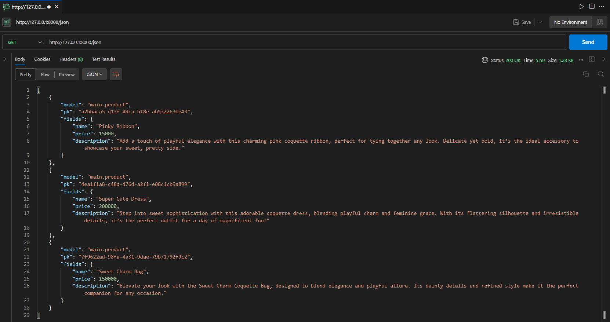
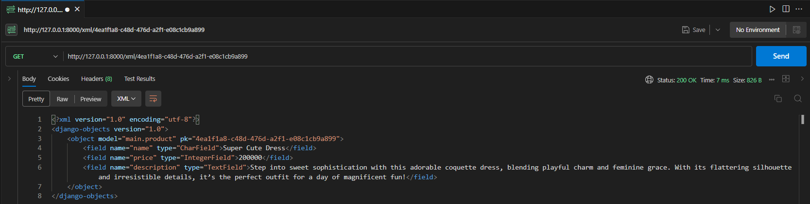
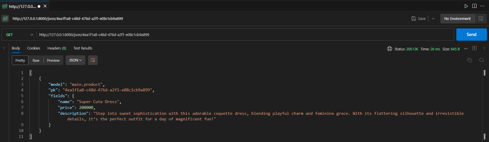

# Marquette

Marquette merupakan proyek Django untuk tugas mata kuliah Pemrograman Berbasis Platform Ganjil 2024/2025 oleh Steven Setiawan dengan NPM 2306152260.

PWS Link : http://steven-setiawan-marquette.pbp.cs.ui.ac.id/

## Daftar Isi
- [README.md Tugas 2](#tugas-2)
  - [Implementasi Checklist Tugas 2](#jelaskan-bagaimana-cara-kamu-mengimplementasikan-checklist-di-atas-secara-step-by-step-bukan-hanya-sekadar-mengikuti-tutorial)
  - [Bagan request client ke web aplikasi berbasis Django](#buatlah-bagan-yang-berisi-request-client-ke-web-aplikasi-berbasis-django-beserta-responnya-dan-jelaskan-pada-bagan-tersebut-kaitan-antara-urlspy-viewspy-modelspy-dan-berkas-html)
  - [Fungsi Git dalam pengembangan perangkat lunak](#jelaskan-fungsi-git-dalam-pengembangan-perangkat-lunak)
  - [Alasan framework Django dijadikan permulaan pembelajaran](#menurut-anda-dari-semua-framework-yang-ada-mengapa-framework-django-dijadikan-permulaan-pembelajaran-pengembangan-perangkat-lunak)
  - [Mengapa model Django disebut sebagai ORM?](#mengapa-model-pada-django-disebut-sebagai-orm)

- [README.md Tugas 3](#tugas-3)
  - [Implementasi Checklist Tugas 3]
  - [Mengapa kita membutuhkan _data delivery_ dalam sebuah platform?]
  - [Manakah yang lebih baik? XML atau JSON?]
  - [Fungsi is_valid() pada form Django]
  - [Mengapa kita membutuhkan csrf_token dalam membuat form?]
  - [Dokumentasi hasil akses URL pada Postman]

## Tugas 2

## Jelaskan bagaimana cara kamu mengimplementasikan checklist di atas secara step-by-step (bukan hanya sekadar mengikuti tutorial).

### Membuat sebuah proyek Django baru
Untuk membuat proyek Django baru, langkah pertama yang saya lakukan adalah membuat folder dengan nama proyek yang saya inginkan.

Untuk melakukan itu, saya menjalankan command berikut:

```
mkdir marquette
cd marquette
```

Setelah itu, saya membuat dan mengaktifkan virtual environment pada folder tersebut dengan menggunakan command berikut:

```
python -m venv env
env\Scripts\activate
```

Kemudian, saya membuat file `requirements.txt` dan mengisinya dengan dependency proyek yang saya butuhkan. Lalu, saya menjalankan command berikut untuk menginstall seluruh module tersebut di virtual environment saya.

```
pip install -r requirements.txt
```

Setelah melakukan penginstallan dependency, saya membuat sebuah proyek Django baru dengan nama `marquette` menggunakan command berikut:

```
django-admin startproject marquette .
```

Di dalam folder marquette, saya menambahkan `ALLOWED_HOSTS` dalam `settings.py` agar dapat dilakukan deployment secara local.

```py
ALLOWED_HOSTS = ["localhost", "127.0.0.1"]
```

Setelah menambahkan `ALLOWED_HOSTS` tersebut, saya melakukan deployment secara local dengan menggunakan command:

```
python manage.py migrate
python manage.py runserver
```

Deployment berhasil dan dapat diakses melalui http://127.0.0.1:8000/

### Membuat aplikasi main pada proyek
Setelah deployment berhasil dilakukan di local, saya membuat aplikasi `main` pada proyek dengan menjalankan:

```
python manage.py startapp main
```

Terlihat ada folder baru pada root folder dengan nama `main`. Hal ini menandakan bahwa aplikasi main berhasil ditambahkan pada proyek.

### Melakukan routing pada proyek agar dapat menjalankan aplikasi `main`
Selanjutnya, agar aplikasi main dapat dijalankan, kita perlu terlebih dahulu melakukan routing pada proyek. Hal ini dilakukan dengan membuka file `settings.py` pada direktori proyek `marquette` dan menambahkan `main` pada variabel `INSTALLED_APPS`.

```py
INSTALLED_APPS = [
    ...,
    'main'
]
```

### Membuat model pada aplikasi main
Setelah melakukan routing agar dapat menjalankan aplikasi `main`, selanjutnya kita akan membuat model. Hal ini dilakukan dengan memodifikasi file `models.py` pada folder `main`. Berikut adalah kode yang saya tambahkan:

```py
class Product(models.Model) :
    name = models.CharField(max_length=255)
    price = models.IntegerField()
    description = models.TextField()
```

Sebelum melanjutkan proyek ini, terlebih dahulu saya melakukan migration pada models yang saya buat dengan menjalankan:

```
python manage.py makemigrations
python manage.py migrate
```

Migration dilakukan untuk merefleksikan perubahan dalam model ke database schema (memastikan model dicatat dalam database schema).

### Membuat sebuah fungsi pada views.py
Kemudian, saya membuat folder baru pada main dengan nama templates dan membuat file baru bernama main.html. main.html berfungsi sebagai display tampilan dari aplikasi main saya. Berikut adalah kode pada main.html saya:

```html
<!DOCTYPE html>
<html lang="en">
<head>
    <meta charset="UTF-8">
    <meta name="viewport" content="width=device-width, initial-scale=1.0">
    <title>{{ app_name }}</title>

    <h1>Welcome to {{ app_name }}</h1>
    <h2>We're selling all Coquette items y'all ever need!</h2>
    <h4>Made by {{ name }} from {{ class }} class</h4>
</head>
<body>
    
</body>
</html>
```

Untuk mengisi nilai/value pada template variables app_name, name, dan class, saya kemudian membuat fungsi pada views.py di folder `main`. Berikut adalah kode yang saya tambahkan:

```py
def show_main(request) :
    context = {
        'app_name' : 'Marquette',
        'name' : 'Steven Setiawan',
        'class' : 'PBP D'
    }
    return render(request, "main.html", context)
```

### Membuat routing pada urls.py aplikasi main
Selanjutnya, saya melakukan konfigurasi routing urls.py agar aplikasi `main` dapat diakses melalui peramban ketika proyek dijalankan. Saya membuat file baru bernama `urls.py` pada direktori `main` dan menambahkan kode berikut:

```py
from django.urls import path
from main.views import show_main

app_name = 'main'

urlpatterns = [
    path('', show_main, name='show_main'),
]
```

Setelahnya, saya menambahkan routingan URL dari aplikasi main ke `urls.py` pada direktori proyek. Berikut adalah file `urls.py` setelah dilakukan modifikasi:

```py
from django.contrib import admin
from django.urls import path, include

urlpatterns = [
    path('admin/', admin.site.urls),
    path('', include('main.urls')),
]
```

### Melakukan deployment ke PWS
Setelah proyek berhasil dibuat, saya akan menyimpannya pada repository github serta mendeploynya pada PWS.

- **GitHub**

  Untuk menyimpan program yang telah saya buat dalam GitHub, terlebih dahulu saya membuat file `.gitignore` yang berisikan nama-nama file/folder yang tidak ingin saya simpan di dalam repository GitHub.

  Kemudian, saya membuat repository baru bernama `marquette` melalui web https://github.com/ dan kemudian menjalankan command berikut:

  ```
  git init
  git branch -M main
  git remote add origin https://github.com/setiawans/marquette.git
  git add .
  git commit -m "initial commit"
  git push -u origin main
  ```

- **PWS**
  
  Setelah menyimpan program di GitHub, selanjutnya saya akan melakukan deployment menggunakan PWS. Terlebih dahulu saya menambahkan `ALLOWED_HOSTS` pada `settings.py` di direktori proyek.

  ```py
  ALLOWED_HOSTS = ["localhost", "127.0.0.1", "steven-setiawan-marquette.pbp.cs.ui.ac.id"]
  ```

  Selanjutnya, saya menjalankan command berikut:
  ```
  git remote add pws http://pbp.cs.ui.ac.id/steven.setiawan/marquette
  git branch -M master
  git push pws master
  ```

  Apabila ke depannya saya perlu melakukan update pada deployment tersebut, saya dapat menjalankan command berikut:
  
  ```
  git branch -M main
  git push pws main:master
  ```

## Buatlah bagan yang berisi request client ke web aplikasi berbasis Django beserta responnya dan jelaskan pada bagan tersebut kaitan antara urls.py, views.py, models.py, dan berkas html.


Ketika user/client mengakses aplikasi, request akan dikirimkan ke webserver. Request ini akan diolah di `urls.py` dan kemudian diteruskan ke `views.py` yang sesuai/bersangkutan.

Setelah itu, `views.py` akan berinteraksi/berkomunikasi dengan `models.py` yang juga berkomunikasi dengan `database` untuk melakukan proses read/write data jika diperlukan.

Setelah data diproses dan diterima, data akan didisplay oleh `views.py` dengan menggunakan templates yang berisikan berkas html. Halaman html inilah yang akan ditampilkan dan diakses oleh user/client.

## Jelaskan fungsi git dalam pengembangan perangkat lunak!
Git merupakan sebuah _version control system_ yang memungkinkan kita selaku pengembang untuk melacak perubahan-perubahan kode dari waktu ke waktu. Git mempermudah kita melakukan kolaborasi dengan pengembang lainnya secara online dengan memanfaatkan fitur branch yang berbeda. Dengan demikian, setiap anggota tim dapat bekerja tanpa mengganggu kode satu sama lain. Selanjutnya, Git memudahkan pengembang dalam menyimpan proyek-proyek yang telah mereka buat tanpa perlu khawatir adanya kerusakan atau kehilangan pada kode mereka. Selain fungsi-fungsi yang telah disebutkan di atas, Git masih memiliki banyak sekali fungsi lainnya. Secara umum, Git meningkatkan efisiensi setiap pengembang dalam melakukan pengembangan perangkat lunak.

## Menurut Anda, dari semua framework yang ada, mengapa framework Django dijadikan permulaan pembelajaran pengembangan perangkat lunak?
Menurut saya, Django cocok menjadi titik awal pembelajaran pengembangan perangkat lunak karena framework ini berbasiskan bahasa pemrograman Python, yang terkenal ramah untuk dipelajari oleh pemula. Selanjutnya, Django menawarkan arsitektur yang terstruktur sekaligus mudah sekali untuk digunakan oleh para pemula, yakni arsitektur MVT atau Model-View-Template. Selain itu, Django juga memungkinkan pengembangan secara fullstack, yang mendukung hubungan antara front-end dan back-end secara sekaligus dalam satu framework.

## Mengapa model pada Django disebut sebagai ORM?
Model pada Django disebut sebagai ORM (Object-Relational Mapping) dikarenakan Django memetakan objek-objeknya dengan database relasional. ORM menjadi interpreter yang memungkinkan kita berinteraksi dengan database tanpa perlu menuliskan query-query SQL secara manual.

## Tugas 3

## Jelaskan bagaimana cara kamu mengimplementasikan checklist di atas secara step-by-step (bukan hanya sekadar mengikuti tutorial).

### Membuat input `form` untuk menambahkan objek model pada app sebelumnya.
Sebelum membuat input `form`, karena page utama dan form kita memiliki beberapa bagian kode yang sama, maka kita dapat membuat suatu templates umum untuk mengurangi pengulangan kode yang repetitif.
Dalam mengimplementasikan hal tersebut, terlebih dahulu saya membuat direktori baru bernama `templates/` pada direktori utama dan mengisinya dengan berkas `base.html`. Berikut adalah isi dari `base.html`:

```html

<!DOCTYPE html>
<html lang="en">
  <head>
    <meta charset="UTF-8" />
    <meta name="viewport" content="width=device-width, initial-scale=1.0" />
     
  </head>

  <body>
     
  </body>
</html>
```

Setelah itu, agar `base.html` bisa digunakan sebagai template pada proyek kita, kita perlu mengubah `settings.py` terlebih dahulu. Berikut adalah bagian yang saya modifikasi dari `settings.py`:

```py
TEMPLATES = [
    {
        'BACKEND': 'django.template.backends.django.DjangoTemplates',
        'DIRS': [BASE_DIR / 'templates'],
        'APP_DIRS': True,
        ...
    },
]
```

Setelah mengubah `settings.py`, saya langsung mengaplikasikan `base.html` pada berkas `main.html` yang terletak di direktori `main/templates/`. Berikut adalah hasil modifikasi dari `main.html`:

```html


<title>{{ app_name }}</title>



<h1>Welcome to {{ app_name }}</h1>
<h2>We're selling all Coquette items y'all ever need!</h2>
<h4>Made by {{ name }} from {{ class }} class</h4>

```

Selanjutnya, sebelum membuat form, terlebih dahulu kita mengubah primary key dari models yang sebelumnya berbentuk integer menjadi UUID. Hal ini dilakukan untuk mencegah terjadinya serangan IDOR pada proyek yang kita buat. Berikut adalah hasil modifikasi yang saya lakukan pada `models.py`:

```py
from django.db import models
import uuid

class Product(models.Model) :
    id = models.UUIDField(primary_key=True, default=uuid.uuid4, editable=False)
    name = models.CharField(max_length=255)
    price = models.IntegerField()
    description = models.TextField()
```

Setelah itu, kita lakukan migrasi terlebih dahulu dengan menggunakan perintah berikut:

```
python manage.py makemigrations
python manage.py migrate
```

Kita telah berhasil mengamankan proyek kita dari serangan IDOR. Serangan ini sendiri berfokus pada eksploitasi primary key dari setiap objek model yang telah kita buat, dengan demikian, penyerang dapat mengakses objek model yang bukan miliknya.

Kemudian, untuk membuat form, kita tambahkan berkas `forms.py` pada direktori `main`. Kemudian, saya mengisi `forms.py` dengan kode berikut:

```py
from django.forms import ModelForm
from main.models import Product

class ProductForm(ModelForm) :
    class Meta :
        model = Product
        fields = ["name", "price", "description"]
```

Setelah itu, saya melakukan sedikit modifikasi pada `views.py` yaitu melakukan import model dan form serta menambahkan mengimport redirect dari library `django.shortcuts`.

```py
from django.shortcuts import render, redirect
from main.forms import ProductForm
from main.models import Product
```

Selanjutnya, masih di `views.py`, saya menambahkan fungsi baru bernama `create_product`. Berikut adalah potongan kode dari fungsi tersebut:

```py
def create_product(request) :
    form = ProductForm(request.POST or None)

    if form.is_valid() and request.method == "POST" :
        form.save()
        return redirect('main:show_main')
    
    context = {'form' : form}
    return render(request, "create_product.html", context)
```

Secara general, fungsi tersebut akan menampilkan page `create_product.html` kepada user. Apabila form disubmit (request method POST) dan isinya valid (form.is_valid()), maka data yang diinput akan disimpan pada database dan fungsi akan melakukan redirect ke page utama.

Kemudian, saya juga menambahkan sedikit potongan kode pada fungsi `show_main`. Berikut adalah hasil modifikasi pada fungsi `show_main`:

```py
def show_main(request) :
    products = Product.objects.all()

    context = {
        'app_name' : 'Marquette',
        'name' : 'Steven Setiawan',
        'class' : 'PBP D',
        'products' : products # Modifikasi dilakukan disini
    }
    
    return render(request, "main.html", context)
```

Penambahan kode tersebut dilakukan untuk nantinya menampilkan seluruh list product pada `main.html`.

Selanjutnya, kita akan menambahkan views `create_product` ke `urls.py`. Berikut adalah hasil modifikasi yang telah saya lakukan:

```py
from django.urls import path
from main.views import show_main, create_product

app_name = 'main'

urlpatterns = [
    path('', show_main, name='show_main'),
    path('create-product', create_product, name='create_product'),
]
```

Setelah itu, agar fungsi `create_product` bisa menampilkan form yang telah kita buat, kita tambahkan berkas `create_product.html` pada direktori `main/templates/`. Berikut adalah isi dari `create_product.html`:

```html
 

<h1>Add New Product</h1>

<form method="POST">
  
  <table>
    {{ form.as_table }}
    <tr>
      <td></td>
      <td>
        <input type="submit" value="Add Product" />
      </td>
    </tr>
  </table>
</form>


```

Kemudian, kita modifikasi juga `main.html` kita untuk menampilkan seluruh data product yang telah kita buat serta tombol "Add New Product" yang akan melakukan _redirect_ ke halaman form. Berikut adalah potongan kode yang saya tambahkan: 

```html
...

<p>Belum ada data product pada Marquette.</p>

<table>
    <tr>
        <th>Product Name</th>
        <th>Price</th>
        <th>Description</th>
    </tr>

     Berikut cara memperlihatkan data product di bawah baris ini
    
    
    <tr>
        <td>{{product.name}}</td>
        <td>{{product.price}}</td>
        <td>{{product.description}}</td>
    </tr>
    
</table>


<br />
<a href="">
    <button>Add New Product</button>
</a>

```

Form telah berhasil diimplementasikan pada proyek kita! Untuk mengecek apakah proyek dapat berjalan dengan baik, jalankan perintah berikut:

```
python manage.py runserver
```

### Menambahkan 4 fungsi `views` baru untuk melihat objek yang sudah ditambahkan dalam format XML, JSON, XML _by ID_, dan JSON _by id_.

Kemudian, karena sebelumnya kita telah mengimplementasikan pembuatan objek product yang baru menggunakan form, tentu kita perlu mengetahui cara mengakses masing-masing product tersebut. Untuk itu, kita perlu membuat views yang menampilkan data dalam format XML maupun JSON.

Pertama-tama, kita import library `HttpResponse` dan `serializers` dengan menambahkan potongan kode berikut pada `views.py` di direktori `main`:

```py
from django.http import HttpResponse
from django.core import serializers
```

Kemudian, untuk menampilkan data, baik secara keseluruhan ataupun berdasarkan hasil filtering UUID, dalam format XML, saya menambahkan views berikut dalam `views.py`:

```py
def show_xml(request) :
    data = Product.objects.all()
    return HttpResponse(serializers.serialize("xml", data), content_type="application/xml")

def show_xml_by_id(request, id) :
    data = Product.objects.filter(pk = id)
    return HttpResponse(serializers.serialize("xml", data), content_type="application/xml")
```

Pada potongan kode tersebut, fungsi `show_xml` akan mengembalikan seluruh objek yang ada pada database dalam format XML. Hal ini dilakukan dengan mengambil seluruh objek dari model Product, kemudian mengubahnya menjadi format XML dengan memanfaatkan serializers. Fungsi kedua juga mirip, tetapi terdapat filtering pada objek yang diambil, yaitu berdasarkan id.

Hal yang sama juga diimplementasikan untuk menampilkan data dalam bentuk JSON. Berikut adalah potongan kodenya:

```py
def show_json(request) :
    data = Product.objects.all()
    return HttpResponse(serializers.serialize("json", data), content_type="application/json")

def show_json_by_id(request, id) :
    data = Product.objects.filter(pk = id)
    return HttpResponse(serializers.serialize("json", data), content_type="application/json")
```

### Membuat routing URL untuk masing-masing `views`.
Untuk membuat routing URL dari masing-masing `views` tersebut, terlebih dahulu saya melakukan import views ke berkas `urls.py` di direktori `main/`.

```py
from main.views import show_main, create_product, show_xml, show_json, show_xml_by_id, show_json_by_id
```

Setelah melakukan import views, saya kemudian menambahkan path untuk masing-masing view tersebut.

```py
urlpatterns = [
    ...
    path('xml/', show_xml, name='show_xml'),
    path('json/', show_json, name='show_json'),
    path('xml/<str:id>/', show_xml_by_id, name='show_xml_by_id'),
    path('json/<str:id>/', show_json_by_id, name='show_json_by_id'),
]
```

Path pertama dan kedua berfungsi untuk menampilkan seluruh data dalam format XML dan JSON. Sedangkan, path ketiga dan keempat akan menampilkan data sesuai dengan filtering UUID, hal ini terlihat pada bagian kode `<str:id>`. Dengan demikian, misalkan kita ingin melihat product dengan UUID tertentu dalam format JSON, kita hanya perlu membuka URL `http://127.0.0.1:8000/json/<UUID>`.

## Jelaskan mengapa kita memerlukan data delivery dalam pengimplementasian sebuah platform?
Dalam mengimplementasikan sebuah _platform_, _data delivery_ sangat diperlukan untuk proses pertukaran data antara satu bagian/_stack_ dengan bagian lainnya. Dengan adanya mekanisme _data delivery_ ini, proses pengelolaan data, terutama antara front-end dan back-end, akan berjalan jauh lebih baik dan efisien. Hal ini didukung dengan fleksibilitas format data seperti XML dan JSON. Apabila suatu _platform_ tidak mengimplementasikan mekanisme ini, _platform_ yang kita buat tidak akan berfungsi secara maksimal karena data-data yang masuk tidak dapat dikelola dengan baik oleh berbagai komponen/bagian _platform_ tersebut.

## Menurutmu, mana yang lebih baik antara XML dan JSON? Mengapa JSON lebih populer dibandingkan XML?
Menurut diri saya pribadi, JSON masih lebih baik dibandingkan XML karena tingkat readability kode yang lebih baik. Hal ini didasarkan pada fakta bahwa struktur JSON mirip dengan struktur _dictionary_ python yang mengimplementasikan key:value pair, sehingga JSON lebih umum dan mudah untuk dipahami oleh para pengembang. Hal ini juga didukung dengan keringkasan serta simplesitas JSON dibandingkan XML yang terkesan lebih bertele-tele. Selain itu, JSON juga sudah terintegrasi dengan bahasa JavaScript, sehingga memudahkan implementasinya dalam pengembangan _platform_.

## Jelaskan fungsi dari method is_valid() pada form Django dan mengapa kita membutuhkan method tersebut?
Method `is_valid()` berfungsi untuk memvalidasi data yang diinput/dimasukkan oleh user pada form yang telah kita buat. Method ini akan mengecek apakah input yang dimasukkan oleh user sesuai dengan aturan yang telah dibuat sebelumnya. Apabila input dari user dianggap valid, maka method akan mengembalikan respon `True` dan data pada form akan diproses dan disimpan pada database.

Method `is_valid()` diperlukan untuk memastikan kevalidan data dari input yang dimasukkan oleh user. Dengan demikian, kita dapat memastikan integritas serta keamanan _platform_ yang telah kita buat. Selain itu, adanya validasi ini akan memastikan konsistensi serta kebersihan dan memudahkan proses _maintenance_ yang dilakukan oleh para pengembang.

## Mengapa kita membutuhkan csrf_token saat membuat form di Django? Apa yang dapat terjadi jika kita tidak menambahkan csrf_token pada form Django? Bagaimana hal tersebut dapat dimanfaatkan oleh penyerang?
`csrf_token` dibutuhkan dalam pembuatan form di Django untuk mencegah terjadinya _exploit_ CSRF (Cross-Site Request Forgery). CSRF atau sering dikenal sebagai _one-click attacks_ adalah sebuah kerentanan pada keamanan website di mana penyerang akan mengirimkan permintaan berbahaya sebagai user yang sudah terauntetikasi.

Apabila suatu form tidak mengimplementasikan `csrf_token`, maka penyerang dapat dengan mudah melancarkan serangan CSRF. Hal ini didasarkan pada fakta bahwa _platform_ akan menganggap setiap `request` yang dilakukan adalah valid dan benar dari user. Dengan demikian, penyerang dapat mengirimkan _well crafted malicious request_ untuk mengeksekusi _request_ berbahaya.

Dengan mengimplementasikan `csrf_token`, setiap _request_ yang dilakukan oleh user dapat dicek kevalidannya, dikarenakan token ini akan digenerate oleh `server-side application` dan tidak dapat diketahui oleh penyerang, sehingga ketika mereka mengirimkan `request` pada form, _platform_ dapat langsung mengetahui bahwa `request` tersebut bukanlah `request` dari pengguna, melainkan dari penyerang.

## Dokumentasi akses URL pada Postman
- `GET /xml`
  
- `GET /json`
  
- `GET /xml/<UUID>`
  
- `GET /json/<UUID>`
  